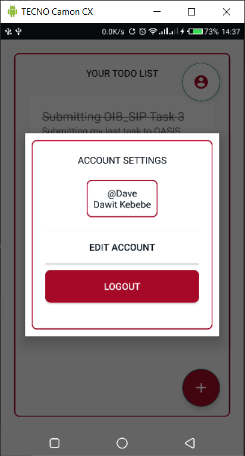

# Todo List App
A simple todo list android app that lets you keep track of your tasks. The project was initiated by an internship opportunity given to me by a company called [OASIS Info Byte](https://oasisinfobyte.com/). It has create, read, update and delete (CRUD) features on SQLite database. It has multi user support. The app is really easy to use and fun to interact with. 

## Methodologies
The app was built on Java with an SQLite support. It utilizes the androids UI features such as, `Spinner`, `RecyclerView`, `CustomAlertDialog` list and `FloatingActionButton`. 

## Feature List

 - Login and Logout For Multiple Users
 - Signup and Manage User Account 
 - Adding Todo Item
 - Marking Todo Item as complete without deleting it
 - Updating or changing Todo Item
 - Deleting Todo Item

## Screenshots and Demonstrations

